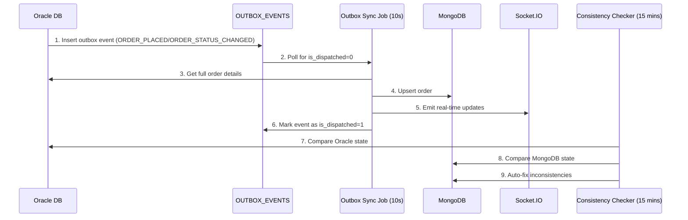
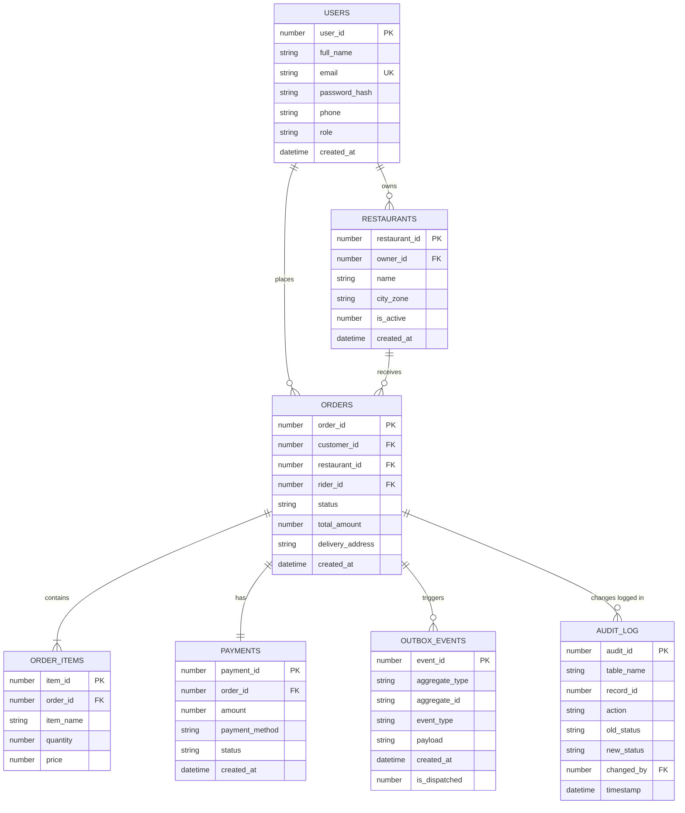

# QuickBite Full Stack Project Documentation

## Table of Contents
1. [Database Overview](#1-database-overview)
2. [Database Schema Details](#2-database-schema-details)
3. [Complete Workflow Documentation](#3-complete-workflow-documentation)
4. [Data Flow Mapping](#4-data-flow-mapping)
5. [Additional Technical Details](#5-additional-technical-details)

---

## 1. Database Overview

### 1.1 List of Databases
| Database | Type | Purpose |
|----------|------|---------|
| Oracle Database | Relational (SQL) | Single source of truth for core transactional data (users, restaurants, orders, payments, audit logs, outbox events) |
| MongoDB | NoSQL (Document) | Read‑optimized data for real‑time dashboards and user interfaces (restaurants with menu, rider locations, chat, offers, reviews, error logs, sync events |

### 1.2 Rationale for Database Selection
#### Oracle Database
- **Use case: Core transactional operations (ACID compliance required for orders, payments, and audit trail
- Advantages: Strong consistency, advanced SQL query capabilities, triggers/procedures for business logic
- Critical for: Order state machine enforcement (ORDER_STATE_MACHINE)

#### MongoDB
- Use case: Real‑time dashboards, flexible unstructured/semi‑structured data (menus, offers, reviews, rider locations
- Advantages: Schema flexibility, fast reads, geospatial queries for rider locations
- Critical for: Restaurant discovery, real‑time order tracking

### 1.3 Inter‑Database Communication & Sync


---

## 2. Database Schema Details

### 2.1 Oracle Schema
#### 2.1.1 Oracle ER Diagram


#### 2.1.2 Oracle Table Details
##### USERS Table
| Column | Type | Constraints | Description |
|--------|------|------------|-------------|
| user_id | NUMBER | PK, Generated as Identity | Unique identifier for users |
| full_name | VARCHAR2(100) | NOT NULL | Full name |
| email | VARCHAR2(100) | UK, NOT NULL | Unique email address |
| password_hash | VARCHAR2(255) | NOT NULL | Bcrypt hashed password |
| phone | VARCHAR2(20) | - | Optional phone number |
| role | VARCHAR2(20) | CHECK (CUSTOMER/RIDER/RESTAURANT/ADMIN/SYNC_JOB) | User's role |
| created_at | TIMESTAMP | DEFAULT CURRENT_TIMESTAMP | Creation timestamp |

##### RESTAURANTS Table
| Column | Type | Constraints | Description |
|--------|------|------------|-------------|
| restaurant_id | NUMBER | PK, Generated as Identity | Unique restaurant ID |
| owner_id | NUMBER | FK → USERS.user_id | ID of owner user |
| name | VARCHAR2(100) | NOT NULL | Restaurant name |
| city_zone | VARCHAR2(50) | NOT NULL | City/zone for filtering |
| is_active | NUMBER(1) | DEFAULT 1 | 1 = active, 0 = inactive |
| created_at | TIMESTAMP | DEFAULT CURRENT_TIMESTAMP | Creation timestamp |

##### ORDERS Table
| Column | Type | Constraints | Description |
|--------|------|------------|-------------|
| order_id | NUMBER | PK, Generated as Identity | Unique order ID |
| customer_id | NUMBER | FK → USERS.user_id | ID of customer |
| restaurant_id | NUMBER | FK → RESTAURANTS.restaurant_id | ID of restaurant |
| rider_id | NUMBER | FK → USERS.user_id | ID of assigned rider |
| status | VARCHAR2(20) | CHECK valid states, DEFAULT 'PLACED' | Order status (PLACED/CONFIRMED/PREPARING/PACKED/WAITING_FOR_PICKUP/WAITING_CONFIRM/PICKED_UP/DELIVERED/CANCELLED |
| total_amount | NUMBER(10,2) | NOT NULL | Total order amount |
| delivery_address | VARCHAR2(255) | - | Delivery address |
| created_at | TIMESTAMP | DEFAULT CURRENT_TIMESTAMP | Creation timestamp |

##### ORDER_ITEMS Table
| Column | Type | Constraints | Description |
|--------|------|------------|-------------|
| item_id | NUMBER | PK, Generated as Identity | Unique item ID |
| order_id | NUMBER | FK → ORDERS.order_id | ID of parent order |
| item_name | VARCHAR2(100) | NOT NULL | Name of menu item |
| quantity | NUMBER | NOT NULL | Quantity |
| price | NUMBER(10,2) | NOT NULL | Price per item |

##### PAYMENTS Table
| Column | Type | Constraints | Description |
|--------|------|------------|-------------|
| payment_id | NUMBER | PK, Generated as Identity | Unique payment ID |
| order_id | NUMBER | FK → ORDERS.order_id | ID of order |
| amount | NUMBER(10,2) | NOT NULL | Payment amount |
| payment_method | VARCHAR2(20) | CHECK (WALLET/CARD/CASH/UPI) | Payment method |
| status | VARCHAR2(20) | DEFAULT 'PENDING' | Payment status (PENDING/COMPLETED/FAILED/REFUNDED |
| created_at | TIMESTAMP | DEFAULT CURRENT_TIMESTAMP | Creation timestamp |

##### OUTBOX_EVENTS Table
| Column | Type | Constraints | Description |
|--------|------|------------|-------------|
| event_id | NUMBER | PK, Generated as Identity | Unique event ID |
| aggregate_type | VARCHAR2(50) | NOT NULL | Type of aggregate (e.g., ORDER) |
| aggregate_id | VARCHAR2(50) | NOT NULL | ID of aggregate |
| event_type | VARCHAR2(50) | NOT NULL | Type of event (e.g., ORDER_PLACED, ORDER_STATUS_CHANGED) |
| payload | CLOB | NOT NULL | JSON payload |
| created_at | TIMESTAMP | DEFAULT CURRENT_TIMESTAMP | Creation timestamp |
| is_dispatched | NUMBER(1) | DEFAULT 0 | 0 = pending, 1 = dispatched |

##### AUDIT_LOG Table
| Column | Type | Constraints | Description |
|--------|------|------------|-------------|
| audit_id | NUMBER | PK, Generated as Identity | Unique audit log ID |
| table_name | VARCHAR2(50) | NOT NULL | Name of modified table |
| record_id | NUMBER | NOT NULL | ID of modified record |
| action | VARCHAR2(20) | NOT NULL | Type of action |
| old_status | VARCHAR2(20) | - | Old status value |
| new_status | VARCHAR2(20) | - | New status value |
| changed_by | NUMBER | FK → USERS.user_id | ID of user who changed |
| timestamp | TIMESTAMP | DEFAULT CURRENT_TIMESTAMP | Timestamp of change |

### 2.2 MongoDB Schema
#### 2.2.1 MongoDB Collections
##### restaurants Collection
```javascript
{
  _id: ObjectId,
  oracle_restaurant_id: Number, // FK to Oracle RESTAURANTS.restaurant_id
  owner_id: Number,
  owner_name: String,
  owner_email: String,
  name: String,
  city_zone: String,
  is_active: Boolean,
  created_at: Date,
  location: {
    type: String, // "Point"
    coordinates: [Number, Number] // [longitude, latitude]
  },
  menu: [
    {
      id: String,
      name: String,
      price: Number,
      original_price: Number, // Preserved for discount calculation
      final_price: Number,
      description: String,
      category: String
    }
  ],
  cuisine: [String],
  avg_rating: Number,
  delivery_fee: Number,
  last_synced: Date
}
```

##### riderlocations Collection
```javascript
{
  _id: ObjectId,
  oracle_rider_id: Number, // FK to Oracle USERS.user_id
  name: String,
  email: String,
  phone: String,
  status: String, // "AVAILABLE", "BUSY"
  location: {
    type: String, // "Point"
    coordinates: [Number, Number]
  },
  last_updated: Date
}
```

##### orders Collection
```javascript
{
  _id: ObjectId,
  order_id: Number, // FK to Oracle ORDERS.order_id
  customer_id: Number,
  customer_name: String,
  customer_email: String,
  restaurant_id: Number,
  oracle_restaurant_id: Number,
  restaurant_name: String,
  rider_id: Number,
  status: String,
  total_amount: Number,
  delivery_address: String,
  items: [
    {
      item_id: Number,
      order_id: Number,
      item_name: String,
      quantity: Number,
      price: Number
    }
  ],
  created_at: Date,
  last_synced: Date
}
```

##### offers Collection
```javascript
{
  _id: ObjectId,
  restaurant_id: Number,
  restaurant_name: String,
  title: String,
  description: String,
  discount_pct: Number,
  is_active: Boolean
}
```

##### reviews Collection
```javascript
{
  _id: ObjectId,
  order_id: Number,
  customer_id: Number,
  restaurant_id: Number,
  rider_id: Number,
  restaurant_rating: Number,
  rider_rating: Number,
  comment: String,
  created_at: Date
}
```

##### chat_messages Collection
```javascript
{
  _id: ObjectId,
  order_id: Number,
  sender_id: Number,
  sender_role: String, // "CUSTOMER", "RIDER"
  message: String,
  created_at: Date
}
```

##### sync_events Collection
```javascript
{
  _id: ObjectId,
  event_id: Number, // FK to Oracle OUTBOX_EVENTS.event_id
  order_id: Number,
  event_type: String,
  payload: Mixed,
  synced_at: Date
}
```

##### error_logs Collection
```javascript
{
  _id: ObjectId,
  timestamp: Date,
  severity: String, // debug, info, warning, error, critical
  message: String,
  stack: String,
  metadata: Object,
  order_id: Number // Indexed
}
```

---

## 3. Complete Workflow Documentation

### 3.1 Order Placement Workflow
```mermaid
flowchart LR
    A[Customer selects<br/>Restaurant Menu] --> B
    B[Add items to cart<br/>Calculate totals] --> C
    C[Submit order] --> D
    D[Backend: Start Oracle<br/>Transaction]
    D --> E
    E[INSERT INTO ORDERS]
    E --> F
    F[INSERT INTO ORDER_ITEMS]
    F --> G
    G[INSERT INTO PAYMENTS]
    G --> H
    H[INSERT INTO OUTBOX_EVENTS<br/> (ORDER_PLACED)]
    H --> I
    I[Commit Oracle Transaction]
    I --> J
    J[Outbox Sync Job<br/>(Poll every 10s)]
    J --> K
    K[Get order from Oracle<br/>JOIN USERS/RESTAURANTS]
    K --> L
    L[Upsert into<br/>MongoDB.orders]
    L --> M
    M[Emit Socket.IO events: new_order to restaurant and order_placed to customer]
    M --> N
    N[Mark OUTBOX_EVENTS.is_dispatched=1]
```
| Step | Database Operation | DB |
|------|---------------------|----|
|1| SELECT restaurants with menu and offers | MongoDB |
|2| Local calculation (original_subtotal, discount, final) | N/A (client side) |
|3-8| Transaction inserting ORDERS, ORDER_ITEMS, PAYMENTS, OUTBOX_EVENTS | Oracle |
|9| COMMIT | Oracle |
|10-14| Sync order to MongoDB, emit real‑time events, mark outbox as dispatched | Oracle + MongoDB |

### 3.2 Order Status Update Workflow

```mermaid
flowchart LR
    A[User updates order status<br/>e.g., restaurant marks PREPARING]
    A --> B
    B[Backend: CALL<br/>ORDER_STATE_MACHINE]
    B --> C
    C[Oracle trigger: trg_order_status_change]
    C --> D
    D[INSERT INTO OUTBOX_EVENTS<br/>ORDER_STATUS_CHANGED]
    D --> E
    E[INSERT INTO AUDIT_LOG]
    E --> F
    F[Outbox Sync Job]
    F --> G
    G[Get order details from Oracle]
    G --> H
    H[Upsert to MongoDB.orders]
    H --> I
    I[Emit Socket.IO order_update]
    I --> J
    J[Mark OUTBOX_EVENTS.is_dispatched=1]
```


### 3.3 Consistency Check Workflow (Runs every 15 minutes)
1. Get all restaurants from Oracle → sync missing ones to MongoDB
2. Get all riders from Oracle → sync missing ones to MongoDB
3. Get all orders from Oracle:
   a. If missing in MongoDB: recover from Oracle
   b. If status mismatch: auto‑fix
   c. Log warnings to error_logs

---

## 4. Data Flow Mapping

| Data Element | Origin DB | Systems Processed By | Final Storage DB | Rationale for Storage Location |
|--------------|----------|-------------------|-----------------|-------------------------------|
| User account (name, email, password | Oracle | Auth backend, auth routes | Oracle | ACID compliance for identity/security |
| Restaurant (core info) | Oracle | Restaurant portal, customer discovery | Oracle + MongoDB | Oracle source of truth, MongoDB for read optimization |
| Restaurant (menu, offers, reviews) | MongoDB | Restaurant menu, discovery | MongoDB | Flexible schema, fast reads |
| Rider location | MongoDB | Rider app, order assignment | MongoDB | Geospatial queries for real‑time tracking |
| Order (transactional) | Oracle | Order routes, state machine | Oracle + MongoDB | Oracle source of truth, MongoDB for real‑time tracking |
| Order items | Oracle | Order routes, checkout | Oracle | ACID |
| Payments | Oracle | Checkout, payment routes | Oracle | Financial ACID compliance |
| Chat messages | MongoDB | Chat routes | MongoDB | Flexible, real‑time chat |
| Outbox events | Oracle | Outbox sync | Oracle + MongoDB | Oracle for durability, MongoDB for audit |
| Error logs | MongoDB | Monitoring | MongoDB | No schema, fast write |
| Audit log | Oracle | Admin portal | Oracle | Immutable audit trail |

---

## 5. Additional Technical Details

### 5.1 Connection & Security
#### Oracle Connection
- **Driver**: oracledb (Node.js)
- **Configuration**:
  - user: ORACLE_USER
  - password: ORACLE_PASSWORD
  - connectString: ORACLE_CONNECTSTRING
  - Environment variables (.env file)
- **Security**:
  - Password hashing: bcrypt
  - Role‑based access control (RBAC)
  - Auditing via AUDIT_LOG table
  - Transactions with proper transaction boundaries

#### MongoDB Connection
- **Driver**: Mongoose ODM
- **Configuration**: MONGO_URI (from .env)
- **Security**:
  - Network isolation
  - Role‑based access
  - Indexes for performance

### 5.2 Indexing
#### MongoDB Indexes
| Collection | Index | Purpose |
|------------|-------|---------|
| restaurants | oracle_restaurant_id | Fast lookup for sync |
| riderlocations | oracle_rider_id | Fast lookup for sync |
| orders | order_id | Fast lookup for sync and UI |
| error_logs | timestamp | Sort errors by time |
| error_logs | severity | Filter errors by level |
| error_logs | order_id | Filter errors by order |

### 5.3 Backup & Recovery
- **Oracle**: Regular full/incremental backups (RMAN)
- **MongoDB**: mongodump snapshots
- **Disaster Recovery**:
  - Consistency checker recovers from Oracle → MongoDB
  - Outbox sync retries on failure

### 5.4 Scaling
- **Oracle**: Read replicas for reporting
- **MongoDB**: Sharding by restaurant_id/rider_id
- **Performance Optimization:
  - Outbox sync job batches 100 events per cycle
  - Geospatial indexes for rider locations
  - Caching frequent restaurant reads

### 5.5 Version Control & Migrations
- **Oracle**: QuickBite_Dev.sql for schema setup and seed
- **MongoDB**: No formal migrations (schema‑less, uses Mongoose schemas as reference
